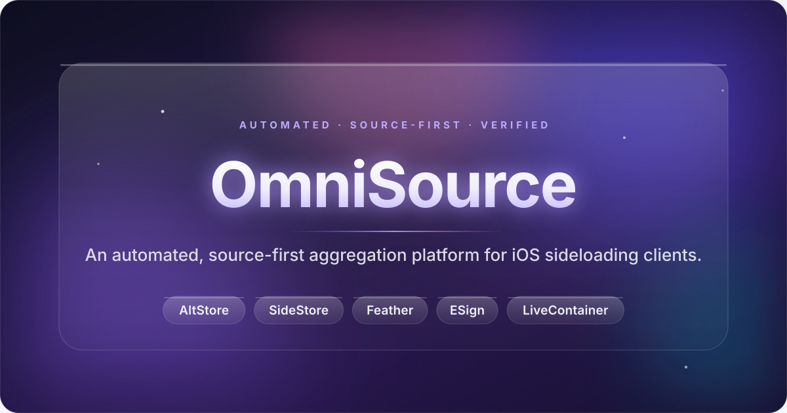
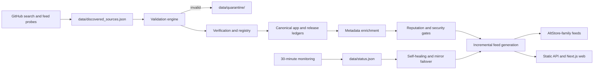

<div align="center">



<br>

[](https://github.com/iamsmmh/OmniSource/actions/workflows/validate.yml)
[](https://github.com/iamsmmh/OmniSource/actions/workflows/security.yml)
[](https://iamsmmh.github.io/OmniSource/)
[](https://iamsmmh.github.io/OmniSource/)
[](https://iamsmmh.github.io/OmniSource/status/)
[](https://iamsmmh.github.io/OmniSource/status/)
[](https://iamsmmh.github.io/OmniSource/status/)
[](https://iamsmmh.github.io/OmniSource/apps.json)
[](LICENSE)

<br>

<a href="https://iamsmmh.github.io/OmniSource/install/"></a>

<br>

<a href="https://iamsmmh.github.io/OmniSource/install/?add=altstore"></a>
<a href="https://iamsmmh.github.io/OmniSource/install/?add=sidestore"></a>
<a href="https://iamsmmh.github.io/OmniSource/install/?add=feather"></a>
<a href="https://iamsmmh.github.io/OmniSource/install/?add=esign"></a>
<a href="https://iamsmmh.github.io/OmniSource/install/?add=livecontainer"></a>

<br>

<a href="https://iamsmmh.github.io/OmniSource/"></a>
<a href="docs/API-V3.md"></a>
<a href="docs/"></a>
<a href="CONTRIBUTING.md"></a>
<a href="web/"></a>

**On iPhone?** Tap your client above — the source opens in its Add Source
screen automatically. On desktop, the same link takes you to the
[installation center](https://iamsmmh.github.io/OmniSource/install/),
where you can scan a QR code with your phone.

</div>


## 🌐 Website

OmniSource is live on the web — **https://iamsmmh.github.io/OmniSource/**

Browse the full catalog, search for apps, check source health and add the
source to your client, all from the browser. No app or account needed.

| Quick links | What's there |
|---|---|
| [🏠 Website home](https://iamsmmh.github.io/OmniSource/) | trending apps, collections and stats |
| [⚡ Install center](https://iamsmmh.github.io/OmniSource/install/) | one-tap add links, QR codes and per-client guides |
| [📱 App explorer](https://iamsmmh.github.io/OmniSource/#catalog) | filter and search every app in the catalog |
| [🔎 Source explorer](https://iamsmmh.github.io/OmniSource/sources/) | upstreams, maintainers, cadence and reputation |
| [🧾 Collections](https://iamsmmh.github.io/OmniSource/collections/) | curated shelves — YouTube, music, emulators, utilities |
| [🩺 Status](https://iamsmmh.github.io/OmniSource/status/) | live health, verification and sync reports |
| [🔌 API](https://iamsmmh.github.io/OmniSource/api/index.json) | machine-readable feeds and versioned endpoints |

## ✦ What OmniSource does

OmniSource discovers and aggregates public iOS sources, validates their feed
and release metadata, tracks release history, enriches records, verifies
provenance and hashes, monitors availability, and publishes deterministic
feeds and machine-readable health reports — **fully automated end to end**.

Every entry is resolved from the app's own official upstream project — GitHub
Releases or the developer's official feed — and each download link is
re-probed and re-verified automatically before publication.

It is deliberately **not** a social or marketplace product. There are no
accounts, comments, reviews, ratings, behavioral profiles, personalized
recommendation feeds, or marketplace transactions. Catalog collections are
committed, transparent source groupings; analytics describe repository and
release observations rather than user activity.

| 🔗 One feed, five clients | 🧾 Provenance & hashes | 🤖 Automated end to end |
|---|---|---|
| AltStore Source v2 served to AltStore, SideStore, Feather, ESign and LiveContainer | Official-upstream resolution with SHA-256/SHA-512 coverage and published checksums | Discovery, validation, enrichment and publication run unattended on GitHub Actions |
| **🩺 Self-healing** | **🔍 Transparent by construction** | **🔒 No accounts, no tracking** |
| 30-minute probes, quarantine for invalid sources and mirror failover | A hand-maintained `catalog.json` plus append-only ledgers; generated files are never edited | No sign-in, no analytics on users, no marketplace — only metadata and links |

> 🧊 The hero artwork, pill buttons and dividers are generated from the
> repo's own **Liquid Glass · Fluid Edition** tokens in
> [`assets/design-system/`](assets/design-system/) — the same translucent
> materials, chromatic refraction and aurora diffusion that power the website.

## 📑 Contents

- [Website](#-website)
- [Add the source](#-add-the-source)
- [Catalog preview](#-catalog-preview)
- [Architecture](#-architecture)
- [Repository layout](#-repository-layout)
- [Local development](#-local-development)
- [API & website](#-api--website)
- [Automation](#️-automation)
- [Documentation](#-documentation)
- [Contributing](#-contributing)
- [License](#️-license)

## 🔗 Add the source

The compatibility feed — one URL that every supported client accepts:

```text
https://iamsmmh.github.io/OmniSource/apps.json
```

**On your iPhone**, tap your client in the table (or the badge buttons at the
top of this file). The link first opens the installation center, which hands
off directly to the client's Add Source screen. If the client is not installed
yet, that page also gives you the feed URL and a QR code to add it manually.

| Client | One-tap add | Manual path |
|---|---|---|
|  AltStore | **[Add to AltStore](https://iamsmmh.github.io/OmniSource/install/?add=altstore)** | Settings → Sources → + |
|  SideStore | **[Add to SideStore](https://iamsmmh.github.io/OmniSource/install/?add=sidestore)** | Settings → Sources → + |
|  Feather | **[Add to Feather](https://iamsmmh.github.io/OmniSource/install/?add=feather)** | Sources → Add |
|  ESign | **[Add to ESign](https://iamsmmh.github.io/OmniSource/install/?add=esign)** | Sources → + |
|  LiveContainer | **[Add to LiveContainer](https://iamsmmh.github.io/OmniSource/install/?add=livecontainer)** | Settings → Sources |

> GitHub and most chat apps strip app-specific links (`altstore://`,
> `feather://`, …), which is why the buttons above point at the HTTPS
> installation center rather than at the client scheme directly. That page
> performs the one-tap hand-off for you, from anywhere the README is viewed.

Client-specific feeds are published at
`feeds/clients/{altstore,sidestore,feather,esign,livecontainer}.json`,
single-app feeds at `feeds/single/<slug>.json` (also reachable as
`feeds/<slug>.json` — useful when a client cannot co-install apps sharing a
bundle ID), and collection feeds at `feeds/collections/<slug>.json`. All of
them are generated and validated before publication. Release watchers can
subscribe to the [RSS feed](https://iamsmmh.github.io/OmniSource/feeds/feed.xml).

The same one-tap hand-off works for a single app by adding `&app=<slug>` —
for example, on iPhone, [add Delta straight to AltStore](https://iamsmmh.github.io/OmniSource/install/?add=altstore&app=delta)
or [add Feather's source for one app](https://iamsmmh.github.io/OmniSource/install/?add=feather&app=delta).
This is the workaround for clients that cannot co-install apps sharing a
bundle ID.

## 🗂 Catalog preview

A look inside the validated catalog — every icon opens its published detail
page with release history, hashes, provenance and install links. Browse the
full catalog on the [website](https://iamsmmh.github.io/OmniSource/); the live
**apps** badge at the top of this file always shows the current count.

| | | | | | |
|:--:|:--:|:--:|:--:|:--:|:--:|
| [](https://iamsmmh.github.io/OmniSource/apps/delta/) | [](https://iamsmmh.github.io/OmniSource/apps/ppsspp/) | [](https://iamsmmh.github.io/OmniSource/apps/dolphinish/) | [](https://iamsmmh.github.io/OmniSource/apps/mame4ios/) | [](https://iamsmmh.github.io/OmniSource/apps/provenance/) | [](https://iamsmmh.github.io/OmniSource/apps/utm/) |
| [](https://iamsmmh.github.io/OmniSource/apps/itorrent/) | [](https://iamsmmh.github.io/OmniSource/apps/livecontainer/) | [](https://iamsmmh.github.io/OmniSource/apps/feather/) | [](https://iamsmmh.github.io/OmniSource/apps/apollo/) | [](https://iamsmmh.github.io/OmniSource/apps/spotiflac/) | [](https://iamsmmh.github.io/OmniSource/apps/ytlite/) |
| [](https://iamsmmh.github.io/OmniSource/apps/inkillerplus/) | [](https://iamsmmh.github.io/OmniSource/apps/ttkillerplus/) | [](https://iamsmmh.github.io/OmniSource/apps/telegram-mxgram/) | [](https://iamsmmh.github.io/OmniSource/apps/raintweak/) | [](https://iamsmmh.github.io/OmniSource/apps/redditfilter/) | [](https://iamsmmh.github.io/OmniSource/apps/nexasc/) |


## 🏗 Architecture



The source of truth is the hand-maintained `catalog.json` plus append-only
operational records. Generated feeds and pages are never hand-edited.

| Concern | Implementation | Durable output |
|---|---|---|
| Discovery | `scripts/discovery/` (12-hour GitHub/feed/repository passes) | `data/discovered_sources.json` |
| Quarantine | `src/omnisource/quarantine.py` | `data/quarantine/sources.json` |
| Validation | feed, source, release, metadata validators | rejected candidates never publish |
| Deduplication | bundle/app/repository/release/binary identity keys | `data/canonical_apps.json` |
| Registry | lifecycle, classification, history, health and reputation | `data/source_registry.json` |
| Release tracking | append-only version ledger and rollback planning | `data/release_history.json` |
| Enrichment | normalized developer, descriptions, icons, screenshots and notes | `data/enriched_apps.json` |
| Security | SHA-256/SHA-512 coverage, optional streamed binary verification, provenance | `data/security.json`, `security-report.json` |
| Monitoring | source/feed/download probes and state transitions | `data/status.json` |
| Intelligence | source growth/decline, app churn, cadence and timelines | `data/source_intelligence.json` |
| Search | fuzzy, developer/source/category/tag ranking | `feeds/search-index.json`, API v3 |
| Persistence | JSON adapter now; SQLite and generic DB-API adapters ready | `src/omnisource/repository.py` |
| Extensibility | typed event bus and reviewed plugin ports | `src/omnisource/events.py`, `plugins/` |

## 📦 Repository layout

```text
catalog.json                  hand-maintained application/source declarations
src/omnisource/                domain services, providers, pipeline and adapters
scripts/discovery/             scheduled discovery commands
scripts/validation/            publication gates
scripts/monitoring/            health and status commands
scripts/registry/              source registry build
scripts/intelligence/          source/package intelligence build
scripts/security/              security report and optional binary scan
scripts/backup/                verified disaster-recovery snapshots
feeds/                         canonical generated client and intelligence feeds
api/                           backward-compatible static API mirrors
web/                           Next.js 15 + TypeScript + Tailwind PWA
js/                            zero-dependency GitHub Pages frontend
schemas/                       machine-readable contracts
data/quarantine/              isolated untrusted discovery records
docs/                          architecture, API and operations guides
assets/design-system/          Liquid Glass design tokens (theme, motion, glass)
assets/brand/                  hero, dividers and the pill buttons used above
```

## 🛠 Local development

Runtime code uses Python's standard library. Python 3.11 or newer is required.
Node 22 is used for the modern web application.

```bash
# Run from the repository root
export PYTHONPATH=src
python3 -m unittest discover -s tests
python3 scripts/validate.py
python3 scripts/validation/validate_feed.py feeds/apps.json --allow-duplicates
python3 scripts/validation/validate_metadata.py feeds/apps.json
python3 scripts/audit.py

# Offline deterministic pipeline
make build             # sync configured upstreams and rebuild feeds
make derived           # canonical, history, enrichment, registry and API
make monitoring        # status, self-healing and mirrors (offline-safe)
make security          # validation plus security report
make check             # lint/validation/tests/smoke checks when tools are installed
make serve             # build and serve the static site on 0.0.0.0:8000
```

Do not put IPA payloads, tokens, or HTTP caches in Git. Use `.env` locally
(`.env.example` documents supported overrides); credentials are scoped to
provider API hosts and are never attached to download probes.

## 🌐 API & website

The backward-compatible feed/API surface remains available:

- `apps.json` — AltStore Source v2 feed;
- `api/*.json` — flat machine-readable snapshots and gzip twins;
- `api/v2/` — legacy delta-friendly endpoints;
- `api/v3/` — versioned pagination, filtering, sorting, fuzzy search, ETags,
  cache headers, sources, releases, status, security and analytics;
- `feeds/install.json` — machine-readable per-client deep links and setup
  steps, which the [installation center](https://iamsmmh.github.io/OmniSource/install/)
  renders (the README's add buttons link there with `?add=<client>`).

The modern app in `web/` provides Home, Apps, Sources, Collections, Categories,
Developers, Statistics, Status, Security, Search, About, source timelines,
source detail pages, and app release/security detail pages. It supports English,
Bangla, Arabic, Spanish, French, German, Japanese, and Chinese with lazy
loading and English fallback. The static PWA remains the GitHub Pages safety
path while `web/` can run on any Node host.

```bash
cd web
npm ci
npm run typecheck
npm run lint
npm run build
npm run dev
```

See [docs/API-V3.md](docs/API-V3.md) for the contract and
[web/README.md](web/README.md) for deployment.


## ⚙️ Automation

| Workflow | Schedule | Purpose |
|---|---:|---|
| `discovery.yml` | every 12 hours | discover GitHub, GitLab, Codeberg, Forgejo and feed candidates; isolate invalid sources |
| `sync.yml` | every 6 hours | resolve releases, build and publish feeds |
| `validation.yml` / `validate.yml` | PR/push | structural, metadata, translation and regression gates |
| `monitoring.yml` | every 30 minutes | probes, status, self-healing plans and mirrors |
| `security.yml` | daily + supply-chain changes | security report and fail-closed critical gate |
| `analytics.yml` | daily | daily/weekly/monthly rollups |
| `publish.yml` | after feed changes + daily | canonical registry, intelligence, client feeds and API |
| `backup.yml` | daily/weekly/monthly | verified metadata-only recovery artifacts |
| `website.yml` | web changes | Next.js typecheck, lint and production build |

Every shell block uses strict mode, quoted variables, HTTPS allowlists, least
privilege permissions, concurrency controls, and an explicit commit allowlist.
Untrusted workflow inputs are passed through environment variables and
validated before use.

## 📚 Documentation

- [Installation center](https://iamsmmh.github.io/OmniSource/install/) — one-tap links, QR codes, per-client guides
- [Complete audit](audit-report.md)
- [Architecture and diagram](docs/ARCHITECTURE.md)
- [Discovery and quarantine](docs/DISCOVERY.md)
- [API documentation](docs/API.md) · [API v3](docs/API-V3.md)
- [Operations and self-healing](docs/OPERATIONS.md)
- [Security report](docs/SECURITY-REPORT.md)
- [Performance report](docs/PERFORMANCE-REPORT.md)
- [Migration guide](docs/MIGRATION.md)
- [Deployment guide](docs/DEPLOYMENT-GUIDE.md)
- [Final deliverables and known limitations](docs/FINAL-DELIVERABLES.md)
- [Contributing](CONTRIBUTING.md)

## 🤝 Contributing

Edit `catalog.json`, schemas, source modules, or documentation — not generated
feeds, API copies, app pages, or operational snapshots. Add a test for every
new validator or provider. Run `make check` and the relevant workflow command
before opening a pull request. New source formats should use a plugin rather
than modifying core dispatch code.


## ⚖️ License

OmniSource is GPL-3.0. App names, icons, trademarks, and upstream releases
belong to their respective owners. OmniSource aggregates metadata and links to
public publishers; it does not claim ownership of upstream binaries.

<div align="center">

<a href="https://iamsmmh.github.io/OmniSource/install/"></a>

</div>
